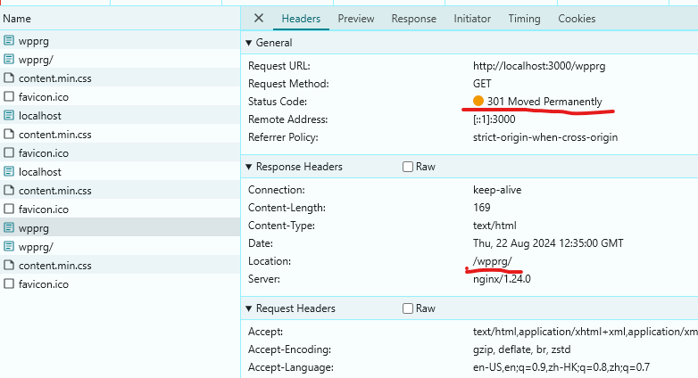

# Background

Nginx runs on a different port than the port user accesses the web page.

If Nginx can't find the file under $uri, it will try to find index.html/ index.htm under folder $uri. Nginx will try to redirect to folder $uri.

    location / {
        index index.html index.htm;
        try_files $uri $uri/ /wpprg/index.html =404;
    }

# Solution

Return the redirection location without the protocol, domain and port. Browser will add automatically.

Add below property in nginx.conf

```
 absolute_redirect off;
```


